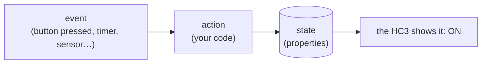

# 03 · QuickApp anatomy

Now the real thing. In this chapter you meet the Sunset Lamp, learn the three
ideas every QuickApp is built from, and click its switch in a browser —
while the whole thing still runs safely on your computer.

## What a QuickApp is

A QuickApp is a small program that *lives on your HC3*. Most of the time it
does nothing. Then something happens — a button is pressed, a timer fires,
a sensor reports — and the QuickApp wakes up, runs a few lines of code, and
goes back to sleep.

That "something happens" has a name: an **event**. And the code that runs is
an **action**. That's idea number one:



The lamp we're about to build is tiny, but it has the full skeleton:

- it **starts** once (`onInit`),
- it **reacts** when someone switches it (`turnOn`, `turnOff`),
- it **remembers** whether it's on — in its *properties*, which the HC3
  shows in the app.

## The Sunset Lamp

Create `sunset_lamp.lua` in your project (or use the repo's copy at
`examples/sunset_lamp.lua`):

```lua
--%%name:SunsetLamp
--%%type:com.fibaro.binarySwitch
-- --------------- EOH ---------------

function QuickApp:onInit()
  self:debug("Sunset lamp ready")
end

function QuickApp:turnOn()
  self:updateProperty("value", true)
  print("Lamp on")
end

function QuickApp:turnOff()
  self:updateProperty("value", false)
  print("Lamp off")
end
```

Line by line:

- `--%%name:SunsetLamp` — the QuickApp's name, as it will appear in the HC3
  app. The `--%%` lines at the top are the QuickApp's *header*: instructions
  to flua (and later, to the HC3) about this QuickApp.
- `--%%type:com.fibaro.binarySwitch` — this QuickApp pretends to be a
  *binary switch*: a device that is ON or OFF. That's what gives it the
  On/Off buttons you're about to see.
- `-- --------------- EOH ---------------` — "end of header". Everything
  after this line is the program itself.
- `function QuickApp:onInit()` — runs **once**, when the QuickApp starts.
  (The `self:debug(...)` writes a line to the log, tagged with the lamp's
  name.)
- `function QuickApp:turnOn()` — an **action**. It runs when someone turns
  the lamp on — a finger in the HC3 app, a scene, another QuickApp.
- `self:updateProperty("value", true)` — the lamp's state. `value` is the
  property of a switch: `true` = on. After this line, the HC3 app shows the
  lamp as ON — the QuickApp *is* the device, and this is how it tells the
  world.
- `turnOff()` is the mirror image: `value` becomes `false`.

That's the whole anatomy: **onInit** (start once), **actions** (react),
**properties** (remember and show).

## Run it — and click the switch

flua can serve the QuickApp's UI to a small viewer page, so you can click
the buttons exactly like in the HC3 app:

```bash
flua --api local --ui 8090 sunset_lamp.lua
```

```text
flua: UI API on http://127.0.0.1:8090 — open viewer/index.html
🚀 flua 0.1.12 (Lua 5.5, Python 3.14.3), mode offline
[04.10.2026][20:11:17][DEBUG  ][SunsetLamp5000]: Sunset lamp ready
```

Now open `viewer/index.html` in a browser (the file lives in the flua
repository — GitHub users: the `viewer/` directory; `pip` users: download it
from the same place). The page opens with the address `http://127.0.0.1:8090`
already filled in — press **Connect**.

> ✅ **You should see** a panel titled `SunsetLamp`, with a red `FALSE`
> label and **Turn On / Turn Off** buttons.

You didn't write a single line about those buttons. flua added them because
your QuickApp declared itself a `binarySwitch` — the HC3 does exactly the
same: every switch gets On/Off controls and a state label for free. (That's
why `--%%type` matters.)

Click **Turn On**.

> ✅ **You should see** two things: the label flips to a green `TRUE`, and
> your terminal logs `Lamp on`.

```text
[04.10.2026][20:11:19][DEBUG  ][SunsetLamp5000]: Lamp on
```

Walk through what just happened, because it's the whole game:

1. You clicked **Turn On** in the viewer.
2. The viewer called your QuickApp's `turnOn` **action**.
3. Your code wrote `true` into the `value` **property**.
4. The state changed — and the label (the viewer reads the state) flipped.

On your real HC3 it would have been a finger in the Fibaro app, and the lamp
would have been a light in your house. Everything else is identical.

Click **Turn Off**, then on again. Each click is one event, one action, one
state change.

Press `Ctrl-C` in the terminal to stop flua.

## What did we just learn?

- A QuickApp **starts once** (`onInit`), **reacts to events** (actions like
  `turnOn`), and **remembers state** (properties like `value`).
- The **type** you choose decides what the HC3 shows: a switch gets On/Off
  buttons; a sensor gets a reading; a dimmer gets a slider.
- You develop against a **browser UI** on your computer; the same events
  come from the HC3 app later.

## Next

The lamp switches when *you* want it to. Next chapter it learns to switch
**by itself** — when the sun goes down. That needs a timer, and a tiny bit
of astronomy the HC3 does for us.
