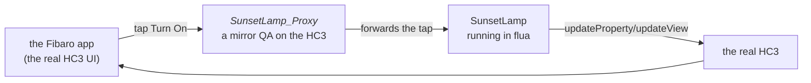

# 08 · Proxy mode — the real HC3 UI

The viewer is a faithful stand-in, but the *real* HC3 UI — the phone app,
with its device cards, rooms and history — is what your family will use.
Proxy mode gives you exactly that, while the QuickApp itself keeps running
in flua on your computer.

## The idea



flua deploys a small mirror QuickApp — `<name>_Proxy` — onto your HC3. The
mirror has the same type and UI as your QA, so the app renders it like any
device. When you tap a button, the proxy forwards the interaction to flua,
your code runs on your computer, and every state change is pushed back so
the app shows it. **You get the genuine UI, and you keep the development
loop** — edit, restart, tap.

## What you need

- Online mode with credentials: the `.env` from chapter 01 (proxy mode is
  online only — without credentials flua logs `proxy disabled` and runs the
  QA offline as usual).
- Your computer and the HC3 on the **same network**, and your firewall must
  let the controller reach your machine — flua listens for the proxy's
  callbacks on port 8080 (set `FLUA_PROXY_PORT` in `.env` to change it).

## Turn the lamp into a proxy

Add one line to the lamp's header:

```lua
--%%name:SunsetLamp
--%%type:com.fibaro.binarySwitch
--%%mode:proxy
--%%var:auto=true
--%%var:wattage=60

--%%u:{label="status",text="Automatic mode"}
--%%u:{switch="automatic",text="Automatic",value="true",onReleased="toggleAuto"}
```

Run it — no `--api local` this time, the proxy needs the real HC3:

```bash
flua sunset_lamp_ui.lua
```

```text
flua: proxy installed: 123 SunsetLamp_Proxy
flua: proxy connected — SunsetLamp_Proxy (5000) sends actions and UI events to http://192.168.1.42:8080
🚀 flua 0.1.14 (Lua 5.5, Python 3.14.3), mode proxy:5000
[05.10.2026][21:00:00][DEBUG  ][SunsetLamp5000]: Sunset lamp ready, 60 W
```

> ✅ **You should see** a new device in the Fibaro app — `SunsetLamp_Proxy`,
> with your custom UI. Open it and tap **Turn On**: the log on your computer
> shows `Lamp on`, and the app shows the lamp ON.

What just happened: the tap went from the app to the proxy to flua, ran
`turnOn()` on your computer, and the state update travelled back to the HC3
— one round trip, one log line. The `5000` after `mode proxy:` is the
emulator's id; the proxy's HC3 id (here `123`) is the device id in the app.
They're the same QA.

Your QA now works like a real HC3 citizen: scenes and other QAs can call its
actions, the app shows its state and history, and `self:updateView` /
`updateProperty` / `setVariable` updates appear live in the app. Child
devices (`self:createChildDevice`) are created on the HC3 as the proxy's
children and mirrored back.

Press `Ctrl-C` when you're done — the proxy stays on the HC3 (it's a device
now), and the next run reuses it: flua finds the existing
`SunsetLamp_Proxy`, reconnects it to your computer, and refreshes its UI
from your current `--%%u` directives. The QA file remains the single source
of truth.

## Editing the UI on the HC3 itself

The HC3 has a rudimentary UI editor, and some developers prefer shaping the
proxy's interface there. To make flua **not** clobber those edits on every
connect:

```lua
--%%mode:proxy,noUI
```

The proxy is still reused and connected, but its UI is left exactly as you
edited it — flua logs `proxy UI left untouched`. Without `noUI`, every
connect pushes the UI from your `--%%u` directives (the backward-compatible
behavior).

> A note on honesty, as in chapter 06: this chapter's live steps are flua's
> documented behavior — deploying, CONNECTing and mirroring — but they talk
> to your controller, so rehearse with your scratch QA and watch the log the
> first time. Anything unexpected lands in the next chapter's toolkit.

## What did we just learn?

- **Proxy mode** mirrors your QA onto the HC3 so the *real* app UI drives
  your code in the emulator — actions in, state out, one round trip.
- The proxy is **reused** across runs (UI refreshed from your directives),
  unless you declare `--%%mode:proxy,noUI` to protect HC3-side UI edits.
- Offline/sim first, proxy when you want the genuine UI — the same file,
  one header line apart.

Next: growing out of one file — your own libraries, shared between QAs.
